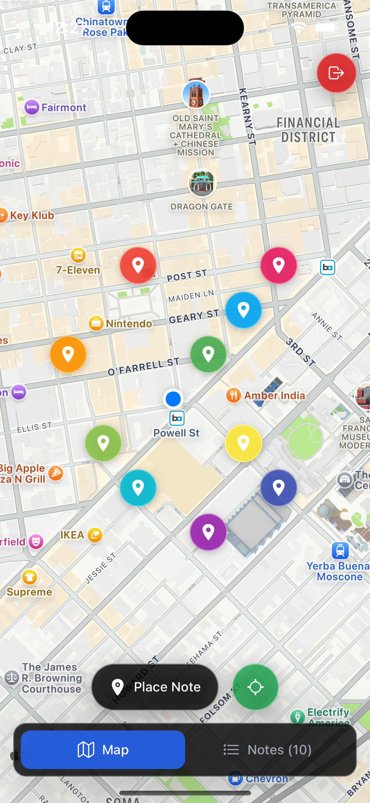
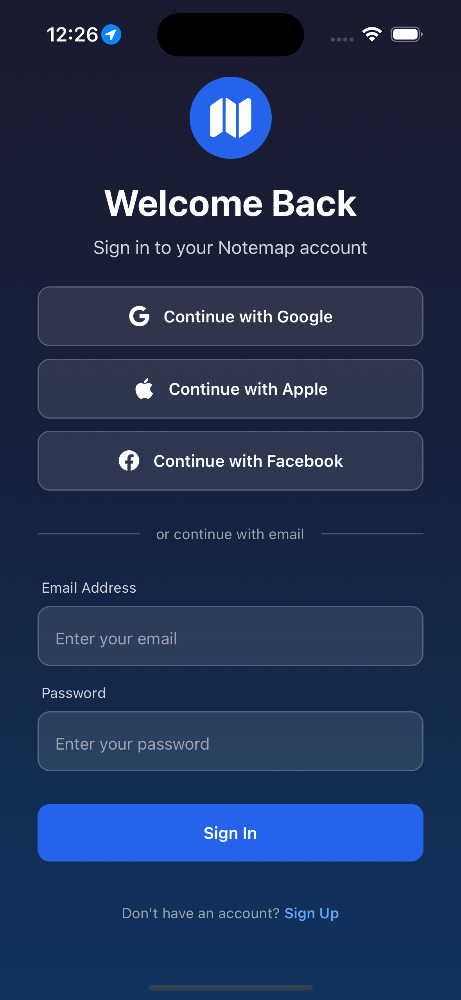
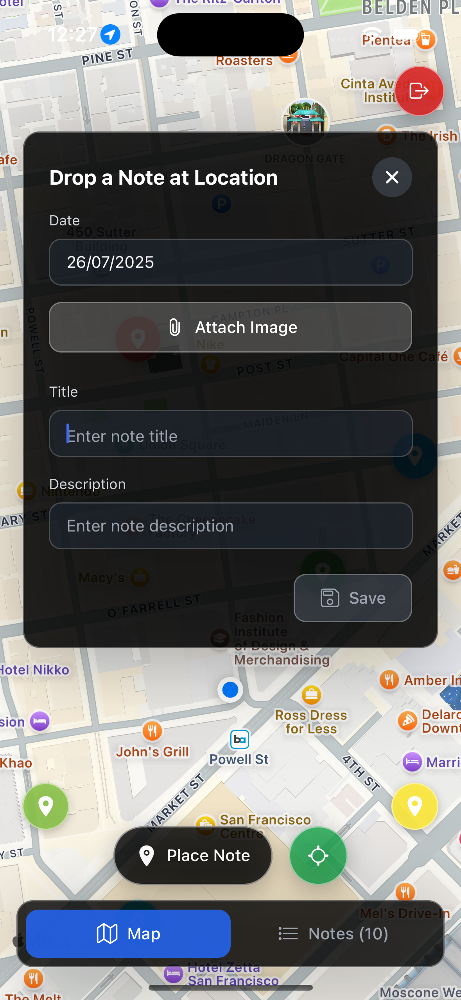
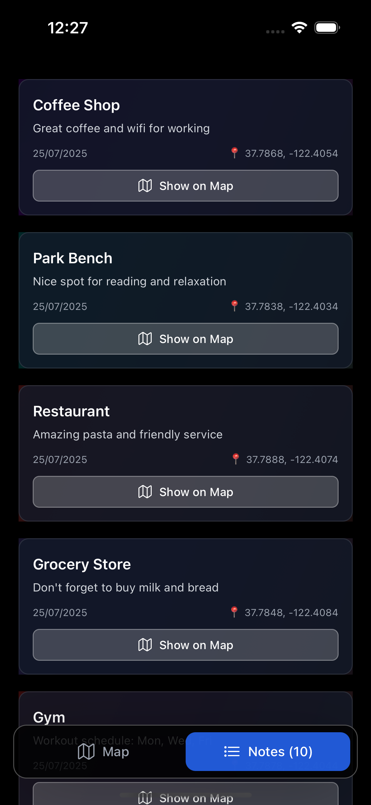

# Notemap 📍

A location-based note-taking app built with React Native and Expo. Create, view, and manage notes anchored to specific geographic locations with image attachments.

## Screenshots

<div align="center">
  
  
</div>

<div align="center">
  
  
</div>

## Features

- **Location-based Notes**: Create and view notes tied to geographic coordinates
- **Interactive Map**: Navigate notes using an integrated map interface
- **Image Attachments**: Attach photos from device gallery to notes
- **Dual View Modes**: Switch between map view and list view
- **User Authentication**: Secure login/signup with Firebase Auth, persistant sessions via tokens stored locally.
- **Persistent Storage**: Local data persistence with AsyncStorage for development
- **Modern UI**: Modern interface with animations and toast notifications for error/success messages

## Tech Stack

- **Framework**: React Native with Expo SDK 53
- **Navigation**: Expo Router with file-based routing
- **Styling**: NativeWind (TailwindCSS for React Native)
- **Maps**: React Native Maps
- **Authentication**: Firebase Auth for Authentication
- **Images**: Expo Image Picker for importing photos from gallery
- **Location**: Expo Location for GPS functionality
- **Animations**: React Native Animated API (Simple Animations; would use the newly Reanimated v4 for more advanced animations)
- **Toast Notifications**: React Native Toast Message

## Setup & Installation

1. **Install dependencies**
   ```bash
   npm install
   ```
2. **Start the development server**
   ```bash
   npx expo start
   ```

 **OPTIONAL: Configure Firebase**
   The project currently uses my own dummy Firebase project. If you are interesting in replacing it with your own Firebase project:
   - Update `config/firebase.ts` with your Firebase project credentials 
   - Enable Authentication in Firebase Console

## Development Practices

- **TypeScript**: Fully typed codebase with strict type checking
- **Component Architecture**: Modular, reusable components with clear interfaces allowing for scalability
- **Context Pattern**: Centralized authentication state management, all note operations are in a different file, making it simple to replace with API requests later once the Backend is developed.
- **Error Handling**: Comprehensive error handling with user feedback via Toast

## Current Status & Known Issue

### Testing Coverage (Potential Bugs)
- ✅ Tested on iPhone 16 for responsiveness
- ❌ Not tested on other Apple devices
- ❌ Not tested on Android emulator
- ❌ Not tested on real devices (other than development)
- ❌ Non-responsive design for all device sizes

### Known Bugs
- **Overlapping Notes**: Notes placed at similar locations hide each other on the map

### Future Features (For MVP)
- **Backend Integration**: Notes are currently stored via local storage, which is sufficient for development. In the future, notes are to be stored via DB (Personally, would build the backend on AWS)
- **Note Clustering**: Show stack of notes when multiple notes are placed at same location
- **Social Authentication**: Login via Google/Facebook/Apple (Very easy via Firebase)
- **Camera Integration**: Add ability to attach images directly from camera (currently gallery only)
- **Map Animation**: Continuous animation over the currently editted note to indicate which one is being editted (attempted to implement, causes flickering bugs with react-native-maps)
- **Animations**: Even more animations (via Reanimated v4) across all interactions in the UI.

### Performance Considerations
- **Map Optimization**: Potential performance issues with too many notes on screen - optimization probably required
- **Device Testing**: Need comprehensive performance testing across real devices.
